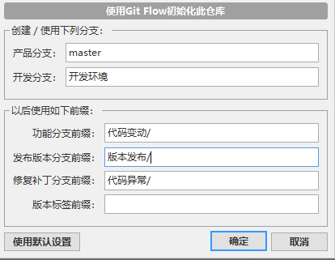

<h1 align="center">档案资料</h1>
<p align="center">个人笔记，工作总结，备忘录</p>
<p align="center">
    
    
    
    
    
	
</p><br/><br/><br/>


## 🟢 个人备忘

4. **<span style='color:Blue'>[ Docsify ]站点启动</span>**

   ```shell
   <script src="//cdn.jsdelivr.net/npm/docsify@4"></script>
   docsify serve ./ -p 3000
   
   
   ```

5. **<span style='color:Blue'>[ Git ]开发规范</span>**

   >[!NOTE|style: flat|label: 简要说明]
   >
   >- [<span style='color:#008B00'>[👓 VisualStudio.gitignore ]</span>](https://github.com/github/gitignore/blob/main/VisualStudio.gitignore ':target=_blank')
   >
   >- `GIT`模板规范
   >
   >```tex
   >[ 代码变动(G) | 代码异常(E) | 版本发布(V) | 提交忽略 ] - {G,E}{index} | v1.x.x
   >
   > - nameof(AClass): 增加功能 AClass( 具体变动 )
   > - nameof(AClass.Print): 变更功能, 内部修改( 具体变动 )
   > - nameof(AClass.Print): 异常修复, 内部修改( 具体变动 )
   >
   >备注: Issues< #1 >
   >
   >```
   >
   >---
   >
   ><span style='color:red'>[`SourceTree`代码管理规范 ]</span>
   >
   >- 初始化`GIT`仓库，提交初始版本`[ 版本发布 ] - v1.0.0`
   >
   >- 初始化`Git Flow`工作流，转到[`开发环境`]
   >
   > 
   >
   >
   >
   >- [`代码变动：G{index}`] [`最终合并 - 开发环境`]
   >
   >- [`代码异常：E{index}`] [`最终合并 - 开发环境`]
   >- [`版本发布：v1.0.0`] [`最终合并 - 开发环境 | 正式环境`]
   >
   >
   >
   ><br/>

   

   

6. **Markdown 常用语法** 

   - 标题规范

   ```markdown
   <br/>
   
   ✴ 二级标题 :id=H2_1
   内容简介
   
   ✴ 二级标题 :id=H2_2
   - 🔸 三级标题 :id=H2_2_3_1
   - 内容简介
   
   ## Header <!-- {docsify-ignore} --> #[ 忽略渲染 ]指定 .md #标题
   
   
   ```

   - 提示 & 警告( Alter )

   ```markdown
   [!NOTE|style: flat|label: 提示信息]
   [!TIP|style: flat|label: 星标信息]
   [!WARNING|style: flat|label: 警告信息]
   ```

   - 插入图片 & 链接

   ```markdown
   <!--云盘下载-->
   [<span style='color:#008B00'>[💾工具下载]</span>](https://www.baidu.com ':target=_blank')
   
   <!--官方首页-->
   [<span style='color:#008B00'>[👓官方首页]</span>](https://www.baidu.com ':target=_blank')
   
   <!--查看文档 | 脚注转向-->
   [<span style='color:#008B00'>[👓查看脚注]</span>](v2?id=t1)
   
   <a href="wwwroot/UML/UML-A.html" target="_blank"><span style='color:#008B00'>[👓 UML ]</span></a>
   
   
   
      <!--支持按百分比缩放-->
   
   
   ```

   - 折叠显示

   ```markdown
   <details> <summary>自我评价（点击展开）</summary> 
   <!-- start -->    
   
   - 内容简介
   
     > ......
   
   <!-- end --> 
   </details>
   ```

   - Tab 选项卡

   ```markdown
   <!-- tabs:start -->
   
   #### **Tab1**
   
   TAB-内容...
   
   #### **Tab2**
   
   TAB-内容...
   
   #### **Tab3**
   
   TAB-内容...
   
   Bonjour!
   
   <!-- tabs:end -->
   ```

   - 徽章生成器

   ```markdown
   <!-- NuGet -->
   <a href="https://www.baidu.com" target="_blank"></a>
   
   <!-- UML -->
   <a href="https://www.baidu.com" target="_blank"></a>
       
   <!-- 程序版本 -->
   
    
   <!-- 工具版本 -->
   
       
   
   ```

   - 类库图标

   ```markdown
   - <span class='class'>自定义类型</span>
   - <span class='interface'>抽象接口</span>
   - <span class='static'>静态类型</span>
   - <span class='attributeClass'>标注特性</span>
   
   - [<span class='class'>自定义类型</span>](c1.0.0)
   - [<span class='interface'>抽象接口</span>](i1.0.0)
   - [<span class='static'>静态类型</span>](e1.0.0)
   - [<span class='attributeClass'>标注特性</span>](a1.0.0)
   
   
   ```

   

   <br/>

   

7. API 常用`类型样式` 

   - `<span class='class'></span>`
   - `<span class='abstract'></span>`
   - `<span class='interface'></span>`
   - `<span class='static'></span>`
   - `<span class='attributeClass'></span>`

8. 常用符号

   -   ↓ → &nbsp;&nbsp;⚠ &nbsp;&nbsp;🟢&nbsp;&nbsp;✴&nbsp;&nbsp;🔸 ☢  ✡ ℹ️ ❗ ❓ ✔️✅ ❌✴️ 🔸🔶🟥🟧🟨🟩🟦🟪♻️

   

  

## 🟢 GitHub Copilot

| 搜索词                                           |
| ------------------------------------------------ |
| `提供案例 \| 如何使用`                           |
| `如何实现`                                       |
| `性能影响 \| 性能需要注意的地方 \| 性能优化建议` |

>[!WARNING|style: flat|label: 简要说明 ]
>
>最佳实践，可以帮助你更好地利用`GitHub Copilot`
>
>- 提供清晰的上下文：
>
>   在代码中添加详细的注释，描述你希望实现的功能
>
>   使用具有描述性的 <span style='color:Blue'>[ 变量名和函数名 ]</span>
>
>- 逐步生成代码：
>
>   如果你的需求比较复杂 <span style='color:red'>[ 可以分步描述 - 每个步骤的具体要求 ]</span>
>
>   逐步生成代码，而不是一次性生成复杂的代码块
>
>- 手动调整和优化：
>
>   受 Copilot 的建议后，手动检查并调整代码，以确保其符合你的需求
>
>   根据需要添加或修改注释和代码
>
>
>```csharp
>// 计算两个数的和
>// 输入：两个整数 a 和 b
>// 输出：a 和 b 的和
>
>
>```
>
><br/>

## 🟢 [`GIT`提交规范 ]

|            |                         |
| ---------- | ----------------------- |
| `feat`     | 功能增加                |
| `fix`      | 功能修复                |
| `refactor` | 代码重构                |
| `perf`     | 性能优化                |
| `docs`     | 更新文档                |
| `style`    | 代码风格 [ 不影响功能 ] |
| `test`     | 功能测试                |
| `revert`   | 代码撤销修改            |
| `ci`       | 持续集成配置变更        |
| `chore`    | `CI/CD`配置变更         |
| `revert`   | 回滚提交                |
| -          |                         |
| `update`   | 综合更新                |

```csharp
feat: 功能增加

1.实现用户注册页面, 包括：
  - 用户名密码输入验证
  - 邮箱格式检查
  - 注册成功后跳转到登录页


```

```csharp
update: 综合更新

功能新增：
- 添加用户权限管理
- 实现消息通知功能

问题修复：
- 修复数据同步异常
- 解决页面加载缓慢

性能优化：
- 优化API响应速度
- 改进缓存策略
    

```

```csharp
update: 综合更新

功能新增：
- 添加用户权限管理
- 实现消息通知功能

问题修复：
- 修复数据同步异常
- 解决页面加载缓慢

性能优化：
- 优化API响应速度
- 改进缓存策略
    

```


