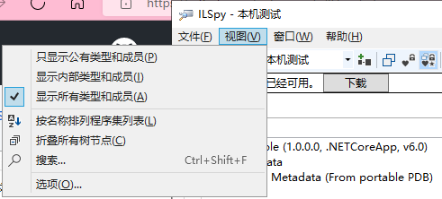
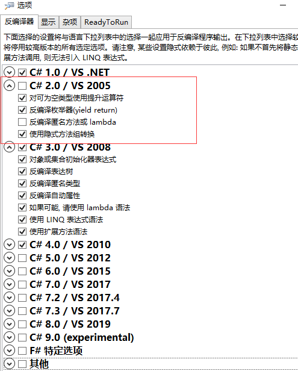

 

## ✴ 企业接口文档解决方案 :id=H2_6

[[👓工具下载 ]](https://mp.weixin.qq.com/s?__biz=MzI3MDE0NzYwNA==&mid=2651442666&idx=2&sn=3459d7e8278b1086664c555af1fef44b&chksm=f128e491c65f6d87cde915e1836816a8c1308a7ff0c9e144a5082a0c9e3bf60cb19926ac0445&mpshare=1&scene=23&srcid=0313s0bbaPBQXXRSlFXdrNcR&sharer_sharetime=1615614640716&sharer_shareid=59de2f213c6a6639f6a4600116f6fabf#rd ':target=_blank') 

[[👓工具下载 ]](https://mp.weixin.qq.com/s?__biz=MzI3MDE0NzYwNA==&mid=2651444851&idx=3&sn=bf5c17ec5e51976e1c7dcb6fec60c214&chksm=f128ff08c65f761e37828226e64f453b8f4fdb75379f09043971fc7f2c0bd3bed553b1e527aa&mpshare=1&scene=23&srcid=0714w42gaLU0ty6Yq3EWvQFF&sharer_sharetime=1626230209057&sharer_shareid=59de2f213c6a6639f6a4600116f6fabf#rd ':target=_blank') 适合编写`Api - 接口文档`的管理工具

## ✴ Git :id=H2_4

[[👓帮助文档]](https://docsifys.gitee.io/docs5/ ':target=_blank') 简要说明介绍

[[👓官方下载]](https://git-scm.com/ ':target=_blank') Git 官方下载地址

[[👓TortoiseGit]](https://tortoisegit.org/download/ ':target=_blank') Git[`可视化`]管理工具

[[👓SourceTree]](https://www.sourcetreeapp.com/ ':target=_blank') Git[`分支管理 - 可视化`]管理工具

[[👓 表情关联 ]](https://mp.weixin.qq.com/s?__biz=MzAwNTMxMzg1MA==&mid=2654095853&idx=4&sn=f32cc8ebb50937bdb83ec21d26938204&chksm=80d86db8b7afe4ae44c411dc057e2780fc45b438bdc005af82e6175d5ed3a468a4ba2068ba56&mpshare=1&scene=23&srcid=03258mhtM10UkcSj6mCGGWYf&sharer_sharetime=1679708124797&sharer_shareid=a6c83a6b87e114417312bf85e473adcb#rd ':target=_blank') 开源：一款基于`Git`提交时的`emoji`表情使用指南

[[👓 Visual Studio ]](https://mp.weixin.qq.com/s?__biz=MzAwNTMxMzg1MA==&mid=2654097755&idx=5&sn=a538dbb4672d4f9ab25ac880e60ec775&chksm=80d8750eb7affc187432663366b02adc2c88fa3b328535e6b9b6d4ef7b7d1a2125405a85fe38&mpshare=1&scene=23&srcid=1103y1RtG3YYNWARW7qkZD8K&sharer_shareinfo=afda37f7d8aa45a0f943aa093efd4429&sharer_shareinfo_first=afda37f7d8aa45a0f943aa093efd4429#rd ':target=_blank') 使用`Git`忽略不想上传到远程仓库的文件 [[👓 .gitignore ]](https://github.com/github/gitignore/tree/main ':target=_blank') 

[[👓 Visual Studio ]](https://docs.gitea.com/zh-cn/ ':target=_blank') Gitea - 本地GIT 服务器

## ✴ WinMerge :id=H2_5

[[👓WinMerge]](https://winmerge.org/ ':target=_blank') 是一款`Windows 系统下`的免费的`文件比较/合并工具`

>[!NOTE|style: flat|label: 简要说明]
>
>- [ 支持`Git`文件冲突合并操作`] 右键冲突文件 → 选择 WinMerge 打开解决冲突` 
>
>- 支持图片比较(`Image compare`)、文件夹比较(`Folder compare`)、 文件比较(`File compare`)
>- 可将[ 当前比较画面结果 → 产生HTML报告 ](`菜单工具 → 生成报告`)

## ✴ Diagrams :id=H2_1

**[[👓draw.io]](https://www.diagrams.net/ ':target=_blank') 是一款完全免费的开源图表绘制工具**

>[!NOTE|style: flat|label: 简要说明]
>
>- 可以用来编辑`工作流、 BPM、 org charts、 UML、 ER图、 网络拓朴图等`
>- 可自建服务器，支持 `Windows、macOS、Linux `客户端

## ✴ Navicat Premium Lite :id=H2_2

- (`Navicat Premium`) 是一套数据库开发工具，让你从单一应用程序中同时连接 MySQL、MariaDB、MongoDB、SQL Server、Oracle、PostgreSQL 和 SQLite 数据库

  [[👓 官方说明 ]](https://mp.weixin.qq.com/s?__biz=Mzk0NDc1NDkyMQ==&mid=2247483823&idx=1&sn=d5246947be3480e989921c4c36c60033&chksm=c2301fc61c4c0c70c3074295fcf45fce29c717308cd9c86e43df60a846c817f1d9b63e72f8f8&mpshare=1&scene=23&srcid=09276LeywE8iwndKkOF48xXh&sharer_shareinfo=334eca94207a8d0b3fa48c68b5592ad2&sharer_shareinfo_first=c4541492300ecb3ec1d8ae11bd7bc6a2#rd ':target=_blank')

## ✴ uTools :id=H2_3

[[👓uTools]](https://www.u.tools/ ':target=_blank') **是一个极简、插件化、跨平台的现代桌面软件( `通过自由选配丰富的插件, 打造你得心应手的工具集合` )**

## ✴ NuGet :id=H2_4

- [[👓 简要说明 ]](https://mp.weixin.qq.com/s?__biz=MzAwNTMxMzg1MA==&mid=2654089798&idx=4&sn=aa6b711edcb7dabac2d7603d7f8b0e62&chksm=80d81613b7af9f0585d8e33eed29ea12d04e3435f63dba258e4cf7a8bb1812f573c92dce3f36&mpshare=1&scene=23&srcid=0505gWaG5Thc2MPzJQTNBR6A&sharer_sharetime=1651712499829&sharer_shareid=a6c83a6b87e114417312bf85e473adcb#rd ':target=_blank')

- [[👓 简要说明 ]](https://mp.weixin.qq.com/s?__biz=MzAwNTMxMzg1MA==&mid=2654083296&idx=4&sn=4bc93f543597d2c9a4d92f5a38aa2272&chksm=80d83cb5b7afb5a3fd1c46f509bcc60d80b4298f298cbd0ccf67f98adef36e93e33cde3cc612&mpshare=1&scene=23&srcid=0408dWKjzuyp7NbXJm4N0U91&sharer_sharetime=1617849254481&sharer_shareid=59de2f213c6a6639f6a4600116f6fabf#rd ':target=_blank')`BaGet`是一个优秀的，轻量级的包管理服务

- [[👓 简要说明 ]](https://mp.weixin.qq.com/s?__biz=MzAwNTMxMzg1MA==&mid=2654095954&idx=4&sn=7870c19f305a65d2d04a2ff59f65b337&chksm=80d86e07b7afe7112f506ad86a1bc2d6055f859d618faae017260ce6c276b38d8439c107e464&mpshare=1&scene=23&srcid=0406vBzKijlyONf4zbvWcSJU&sharer_sharetime=1680711556605&sharer_shareid=a6c83a6b87e114417312bf85e473adcb#rd ':target=_blank') 如何生成自己的`NuGet`包

- [[👓 简要说明 ]](https://mp.weixin.qq.com/s?__biz=MzAwNTMxMzg1MA==&mid=2654089640&idx=3&sn=16f4970364830ae2b01dbb4d3880aa37&chksm=80d815fdb7af9ceb5a8743a822a90f2a113c725af96478f32c02339cdb7e7e6e6a6cf160356c&mpshare=1&scene=23&srcid=04270v3mAOQTWvAKrvx22l9D&sharer_sharetime=1651028520317&sharer_shareid=a6c83a6b87e114417312bf85e473adcb#rd':target=_blank')`NuGet`包汉化工具

## ✴ ApiPost :id=H2_6

[[👓 官方网站 ]](https://www.apipost.cn/ ':target=_blank')支持模拟`POST、GET、PUT`等常见`HTTP`请求，支持团队协作，并可直接生成并导出接口文档的API 文档、调试、Mock、测试一体化协作平台

- [[👓 推荐 ]](https://mp.weixin.qq.com/s/i9WwbP8r2BJ3-fPGYbM_fg ':target=_blank')`10`款程序员常用的`API`管理工具

## ✴ ILspy :id=H2_7

[[👓 官方网站 ]](https://github.com/icsharpcode/ILSpy/releases ':target=_blank') 

 

- 根据反编译程度查看具体信息

- 

## ✴ SmartSQL :id=H2_8

他是一款专为程序猿量身打造的日常开发工具箱，是集成于作者的数据库工具SmartSQL数据库文档查询、导出工具中的一个功能模块

汇聚了码农们日常开发工作时需要用到的各种小工具

[[👓 官方网站 ]](https://mp.weixin.qq.com/s?__biz=MzAwNTMxMzg1MA==&mid=2654095478&idx=1&sn=6ded95181447fdffe64ad6ba6ee944c1&chksm=80d86c23b7afe5355155bebbb32d9e7b8b4fc5ec8fa6617b4b371ea851084217caccb321be40&mpshare=1&scene=23&srcid=021411PCetWF6Ff8AEaaDQUy&sharer_sharetime=1676341672543&sharer_shareid=a6c83a6b87e114417312bf85e473adcb#rd ':target=_blank') 

## ✴ DevToys :id=H2_9

该工具提供了非常多实用工具，包括类型转换、编码/解码类型、格式化类型、生成类型、文本处理类型、图片处理类型7个分类的工具，该工具还采用了全新的`Windows 11`设计，支持亮 / 暗调节。

[[👓 官方网站 ]](https://mp.weixin.qq.com/s?__biz=MzAwNTMxMzg1MA==&mid=2654097305&idx=3&sn=74f7d5ba299a57c631beb6e3ac4d7f4b&chksm=80d86bccb7afe2daf257fe2190cc3549e3faae893bc92195f04a7f2df71c81916921ba27a514&mpshare=1&scene=23&srcid=0902kjGbbfvDX6bsZ2HOHIIo&sharer_shareinfo=f64d19df39e4ca7c02506822b5e9a038&sharer_shareinfo_first=f64d19df39e4ca7c02506822b5e9a038#rd ':target=_blank') 

## ✴ 代码混淆工具 :id=H2_9

JIEJIE.NET 是一个使用 C# 开发的开源 .NET 代码加密工具

[[👓 官方网站 ]](https://mp.weixin.qq.com/s?__biz=MzAwNTMxMzg1MA==&mid=2654096504&idx=1&sn=c48cdedb6517fe462b4a3d5aa7fa9742&chksm=80d8682db7afe13b7d79a45658621188b024a2a452bde58c290c123c72389b16e15bc3658fac&mpshare=1&scene=23&srcid=0428JXcLgQ2FeyEteAQ4vQSt&sharer_sharetime=1682676778650&sharer_shareid=a6c83a6b87e114417312bf85e473adcb#rd ':target=_blank') 

## ✴ 数据库设计工具和 SQL 生成器 :id=H2_10

[[👓 官方网站 ]](https://mp.weixin.qq.com/s?__biz=MzAwNTMxMzg1MA==&mid=2654099365&idx=7&sn=7439e16541b84b09d51f11f87c1c1dcf&chksm=80d873f0b7affae60443d932c9962db842ad873d93311f5490435297d8d62177c32332a32e32&mpshare=1&scene=23&srcid=0511C8znfoX4QRoKFU7hwJHM&sharer_shareinfo=082bba43ee351bc48287c61b1feebd25&sharer_shareinfo_first=082bba43ee351bc48287c61b1feebd25#rd ':target=_blank') 

[[👓 官方网站 ]](https://mp.weixin.qq.com/s?__biz=MzAwNTMxMzg1MA==&mid=2654099868&idx=8&sn=17fd0ad54a65874a3b06c36a9a350634&chksm=80d87dc9b7aff4df15bbcca68746b846e2d97d049931d1d62db0ec111ccd207fa08dd7871090&mpshare=1&scene=23&srcid=0729gYe96p6Cu6rvUFh5SnmB&sharer_shareinfo=c7da527b82dd593c3eacd996f399ddf0&sharer_shareinfo_first=c7da527b82dd593c3eacd996f399ddf0#rd ':target=_blank') 数据库文档生成工具

[[👓 官方网站 ]](https://mp.weixin.qq.com/s?__biz=MzIxMTUzNzM5Ng==&mid=2247512288&idx=1&sn=f8b34ee3c7fe44bee8f5b3a656442cb2&chksm=96dac5ce6d6b8c46ce510ceff8cf8c77aa116e6af9a5e4966b1dbd9e4bd2e41384e28989a1f5&mpshare=1&scene=23&srcid=0412Y0hFUCnSCClVqcHLNij8&sharer_shareinfo=a1638827402198f3fb6309958c441252&sharer_shareinfo_first=a1638827402198f3fb6309958c441252#rd ':target=_blank') 精选 4 款免费且实用的数据库管理工具

## ✴  Linux 服务器管理工具 :id=H2_11

[[👓 官方网站 ]](https://mp.weixin.qq.com/s?__biz=MzIxMTUzNzM5Ng==&mid=2247508891&idx=1&sn=68c739a70fcb021134ba8cb8d6a336fa&chksm=96e78e8a402c5d669f9fbad28d2a3356c5dc1d4d67a3c82c5695361df0e48340c0f0840db864&mpshare=1&scene=23&srcid=1229nvWkmgCRldAayJtoCnuj&sharer_shareinfo=e642670e37c8c57e24d9a3d8fa58a95b&sharer_shareinfo_first=e642670e37c8c57e24d9a3d8fa58a95b#rd ':target=_blank') 

## ✴  开发常用的 8 个镜像站 :id=H2_12

[[👓 官方网站 ]](https://mp.weixin.qq.com/mp/wappoc_appmsgcaptcha?poc_token=HJI1-mejJTirzKq1fN_KFSpVWrOPwYkuEu6eO1ve&target_url=https%3A%2F%2Fmp.weixin.qq.com%2Fs%3F__biz%3DMzI3ODcxMzQzMw%3D%3D%26mid%3D2247616026%26idx%3D2%26sn%3Db57d8cd26a58491a688af3deb1cc3046%26chksm%3Deaa212e9a86aa0465c4f54898b688c698851ec8bb81bfd8d5dfe086882853b409b88d07059dc%26mpshare%3D1%26scene%3D23%26srcid%3D04107PbWNH28jOQtVLOskhyL%26sharer_shareinfo%3D8b9a271c1bfbcc309e265ddf52788f55%26sharer_shareinfo_first%3D8b9a271c1bfbcc309e265ddf52788f55#rd ':target=_blank') 

